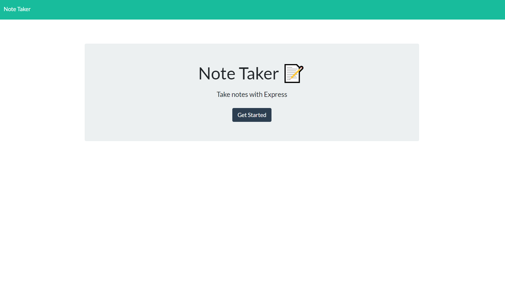

# Note-Taker

## Description

For this project, we are given the frontend code and are tasked with creating the backend.  The backend will use express to save and retrieve data from a JSON file.  The purpose of the application is to write, save and delete notes.

* The following HTML routes should be created:

  * GET `/notes` - Should return the `notes.html` file.

  * GET `*` - Should return the `index.html` file

* The application should have a `db.json` file on the backend that will be used to store and retrieve notes using the `fs` module.

* The following API routes should be created:

  * GET `/api/notes` - Should read the `db.json` file and return all saved notes as JSON.

  * POST `/api/notes` - Should receive a new note to save on the request body, add it to the `db.json` file, and then return the new note to the client.

  * DELETE `/api/notes/:id` - Should receive a query parameter containing the id of a note to delete. This means you'll need to find a way to give each note a unique `id` when it's saved. In order to delete a note, you'll need to read all notes from the `db.json` file, remove the note with the given `id` property, and then rewrite the notes to the `db.json` file.

  This application will also need to be deployed using Heroku 

## Heroku